# 🛡️ SentinelGraph — Graph Intelligence & AML Platform

> **CognoDB Assignment 2 Submission**  
> **Candidate:** Robin Burdewa  
> **Contact:** +91 76671020  
> *Built with **CognoDB Cloud** (openCypher / Bolt Protocol), Python FastAPI, and Modern Interactive Network Visualization.*

---

## 📑 Table of Contents
1. [Executive Summary & Problem Domain](#-executive-summary--problem-domain)
2. [Why a Graph Database? (Relational vs Graph Analysis)](#-why-a-graph-database)
3. [Graph Data Model & Schema Diagram](#-graph-data-model--schema-diagram)
4. [Advanced Cypher Queries Explained](#-advanced-cypher-queries-explained)
5. [Application Features & Visual UI](#-application-features--visual-ui)
6. [Architecture & Project Structure](#-architecture--project-structure)
7. [Step-by-Step Setup & CognoDB Provisioning](#-step-by-step-setup--cognodb-provisioning)
8. [Free Cloud Hosting & Demo Deployment](#-free-cloud-hosting--demo-deployment)
9. [Automated Testing & Verification](#-automated-testing--verification)

---

## 🎯 Executive Summary & Problem Domain

Financial crime networks, sanctions evasion rings, and illicit shell company syndicates are deliberately constructed as **high-depth, obfuscated relationship networks**. In traditional flat tables, uncovering puppet masters (Ultimate Beneficial Owners) hiding behind 5 layers of offshore holding entities or tracing smurfing rings that cycle funds across 4 intermediaries is computationally intractable and architecturally awkward.

**SentinelGraph** is an Anti-Money Laundering (AML), Sanctions Evasion, and Ultimate Beneficial Ownership (UBO) graph intelligence platform. Backed by **CognoDB Cloud**, it ingests real-world financial topologies and provides compliance officers, intelligence analysts, and investigators with real-time graph traversal, circular cycle detection, shortest-path sanctions discovery, and interactive visual graph exploration.

---

## ⚡ Why a Graph Database?

A graph database is not just an alternative storage engine for this domain—it is mathematically and architecturally necessary:

| Dimension | Relational Databases (SQL) | Graph Database (CognoDB / openCypher) |
| :--- | :--- | :--- |
| **Multi-Tier Ownership (UBO)** | Requires recursive CTEs with rigid depth limits and exponential self-joins (`JOIN` on `JOIN`). | Natural variable-length path traversal: `(p:Person)-[:OWNS*1..8]->(c:Company)`. |
| **Circular Money Laundering (Smurfing Rings)** | Extremely slow $O(V^k)$ cyclic self-joins; combinatorial explosion when searching for $k$-hop loops. | Traversal over index-free adjacency: `(acc)-[:TRANSFERRED_TO*3..6]->(acc)` in milliseconds. |
| **Shortest Path to Sanctions** | Requires loading massive adjacency matrices into memory or complex Dijkstra stored procedures. | Built-in graph pathfinder: `shortestPath((start)-[*1..6]-(sanctioned))`. |
| **Adjacency Complexity** | $O(\log N)$ index lookups for each hop in foreign-key join tables. | $O(1)$ index-free pointer hopping directly along physical graph edges. |
| **Schema Evolution** | Rigid schema alterations (DDL migrations) when introducing new entity types or jurisdiction rules. | Flexible property graph model allowing arbitrary node labels and typed edge properties. |

### The "JOIN Explosion" Problem in AML
When an analyst needs to know if a company in Delaware is connected within 5 hops to a sanctioned entity in Russia or an oligarch in Cyprus:
- In **PostgreSQL / MySQL**, each hop requires scanning index b-trees across millions of rows, joining intermediate mapping tables, and multiplying intermediary result sets.
- In **CognoDB**, the engine uses **Index-Free Adjacency**: each node holds direct memory/disk pointers to its connected relationships, enabling deep graph traversals at constant speed regardless of the global dataset size.

---

## 📊 Graph Data Model & Schema Diagram

```mermaid
erDiagram
    PERSON ||--o{ OWNS : "owns {share_pct, since}"
    PERSON ||--o{ DIRECTOR_OF : "controls {role, appointed}"
    PERSON ||--o{ HOLDS_ACCOUNT : "holds {opened}"
    COMPANY ||--o{ OWNS : "subsidiary_of {share_pct, since}"
    COMPANY ||--o{ REGISTERED_IN : "located_at {}"
    COMPANY ||--o{ HOLDS_ACCOUNT : "holds {opened}"
    BANK_ACCOUNT ||--o{ TRANSFERRED_TO : "transfers {amount, currency, timestamp, tx_id, risk_flag}"
    PERSON ||--o{ SANCTIONED_UNDER : "listed_on {listed_date, notice}"
    COMPANY ||--o{ SANCTIONED_UNDER : "listed_on {listed_date, notice}"

    PERSON {
        string id PK "e.g. P-101"
        string name "e.g. Viktor Sterling"
        string nationality "e.g. Russian"
        boolean is_pep "true"
        float base_risk "0.94"
        string role "Beneficial Owner"
    }

    COMPANY {
        string id PK "e.g. C-201"
        string name "e.g. Seashell Global Holdings"
        string jurisdiction "e.g. BVI"
        string company_type "Offshore Shell"
        float risk_score "0.91"
        string status "Active"
    }

    BANK_ACCOUNT {
        string account_number PK "e.g. ACC-9003"
        string bank_name "BVI International Trust"
        string country "BVI"
        float balance "8900000.0"
        string risk_level "CRITICAL"
    }

    SANCTION_LIST {
        string id PK "e.g. SANCT-OFAC-SDN"
        string name "OFAC SDN List"
        string authority "US Dept of Treasury"
        string program "UKRAINE-EO14024"
        string reason "Weapons proliferation"
    }

    JURISDICTION {
        string code PK "e.g. BVI, CY, US"
        string name "British Virgin Islands"
        string risk_tier "TIER_3_HIGH"
        boolean tax_haven "true"
    }
```



---

## 🔍 Advanced Cypher Queries Explained

All queries in SentinelGraph are **100% parameterised** using the official `neo4j` Bolt driver (never concatenated string queries) to ensure plan caching and injection immunity.

### 1. Multi-Hop Circular Smurfing Ring Detection
*Detects closed money laundering loops of 3 to 6 hops where capital returns to the originator:*
```cypher
MATCH path = (origin:BankAccount)-[txs:TRANSFERRED_TO*3..6]->(origin)
WITH path, origin, txs,
     reduce(total = 0.0, t IN txs | total + t.amount) AS total_volume,
     [n IN nodes(path) | n.account_number] AS account_chain,
     [t IN txs | t.tx_id] AS transaction_chain
RETURN DISTINCT
    origin.account_number AS origin_account,
    origin.bank_name AS origin_bank,
    length(path) AS loop_length,
    total_volume,
    account_chain,
    transaction_chain,
    [n IN nodes(path) | properties(n)] AS ring_nodes,
    [r IN relationships(path) | properties(r)] AS ring_edges
ORDER BY loop_length ASC, total_volume DESC
LIMIT $limit;
```

### 2. Recursive Ultimate Beneficial Ownership (UBO) Resolution
*Traverses variable-length ownership chains up to 8 hops deep and computes cumulative effective ownership percentage:*
```cypher
MATCH path = (root:Person)-[owns:OWNS*1..8]->(target:Company {id: $company_id})
WHERE NONE(n IN nodes(path)[1..-1] WHERE n:Person)
WITH root, target, path, owns,
     reduce(effective_pct = 1.0, r IN owns | effective_pct * (r.share_pct / 100.0)) * 100.0 AS effective_share_pct
WHERE effective_share_pct >= $min_share_pct
RETURN
    root.id AS ubo_id,
    root.name AS ubo_name,
    root.nationality AS nationality,
    root.is_pep AS is_pep,
    root.base_risk AS person_risk,
    target.id AS company_id,
    target.name AS company_name,
    round(effective_share_pct * 100.0) / 100.0 AS effective_ownership_pct,
    length(path) AS ownership_depth,
    [n IN nodes(path) | properties(n)] AS ownership_chain,
    [r IN relationships(path) | properties(r)] AS relationship_chain
ORDER BY effective_ownership_pct DESC;
```

### 3. Shortest Path to Sanctioned Entities / PEPs
*Identifies the shortest relationship corridor connecting an entity to OFAC / UN blacklists:*
```cypher
MATCH (start)
WHERE start.id = $entity_id OR start.account_number = $entity_id
MATCH (sanctioned:SanctionList)
MATCH path = shortestPath((start)-[*1..6]-(sanctioned))
WHERE length(path) > 0
RETURN
    length(path) AS distance,
    sanctioned.id AS sanction_id,
    sanctioned.authority AS sanctioning_body,
    sanctioned.program AS sanction_program,
    sanctioned.reason AS sanction_reason,
    [n IN nodes(path) | properties(n)] AS path_nodes,
    [r IN relationships(path) | properties(r)] AS path_relationships
ORDER BY distance ASC
LIMIT 1;
```

### 4. Mule Account Nexus & Centrality Detection
*Finds transit hub accounts with high transaction in-degree and out-degree:*
```cypher
MATCH (acc:BankAccount)
MATCH (in_acc:BankAccount)-[in_tx:TRANSFERRED_TO]->(acc)
MATCH (acc)-[out_tx:TRANSFERRED_TO]->(out_acc:BankAccount)
WITH acc,
     count(DISTINCT in_acc) AS unique_senders,
     count(DISTINCT out_acc) AS unique_recipients,
     sum(in_tx.amount) AS total_inflow,
     sum(out_tx.amount) AS total_outflow
WHERE unique_senders >= 2 AND unique_recipients >= 2
RETURN
    acc.account_number AS account_number,
    acc.bank_name AS bank_name,
    acc.country AS country,
    unique_senders,
    unique_recipients,
    total_inflow,
    total_outflow,
    abs(total_inflow - total_outflow) AS net_retention,
    (unique_senders * unique_recipients * 1.5) AS centrality_index
ORDER BY centrality_index DESC
LIMIT $limit;
```

---

## 💻 Application Features & Visual UI

- **Interactive Vis.js Force-Directed Canvas**: Color-coded nodes, dynamic physics simulation, drag-and-drop, zoom controls, and visual risk indicators.
- **Entity 360° Inspector**: Click any node to slide open its properties, calculated risk score, connected relationships, and one-click actions.
- **Instant Search & Autocomplete**: Real-time debounce search across all persons, companies, accounts, and sanctions.
- **Smurfing Ring Explorer**: Visual breakdowns of detected circular transaction loops with total volume and hop count.
- **UBO Pathway Visualizer**: Step-by-step ownership chain mapping with cumulative percentage calculations.
- **Sanctions Path Tracer**: Visual shortest path to OFAC watchlists with hop-by-hop risk analysis.
- **Live Cypher Query Console**: Interactive query playground with preset high-value queries, live execution time benchmarking, and formatted JSON output.
- **Zero-Friction Fallback & Seeding**: Includes a high-fidelity synthetic syndicate dataset that runs out-of-the-box in standalone mode or seeds directly into CognoDB Cloud with one click.

---

## 🏗️ Architecture & Project Structure

```
Wexa_AI/
├── backend/
│   ├── app/
│   │   ├── config.py              # Pydantic v2 Settings reading .env
│   │   ├── database.py            # Neo4j Driver Connection Manager & Health Checks
│   │   ├── queries.py             # Parameterized Cypher query definitions
│   │   ├── main.py                # FastAPI Application & Static Mounting
│   │   ├── routes/
│   │   │   ├── graph.py           # Subgraph & neighborhood endpoints
│   │   │   ├── analytics.py       # Rings, UBO, Sanctions, Cypher Console
│   │   │   ├── search.py          # Autocomplete search endpoint
│   │   │   └── admin.py           # Health probe, Seed, and Reset operations
│   │   ├── services/
│   │   │   ├── graph_service.py   # Query execution & live/fallback coordination
│   │   │   └── mock_data.py       # High-fidelity realistic syndicate dataset
│   │   └── seed/
│   │       └── seed_data.py       # Automated CognoDB database seeder
│   ├── static/                    # Frontend Web Application
│   │   ├── index.html             # Single-page UI with Lucide & Vis.js
│   │   ├── style.css              # Obsidian Dark Glassmorphic Design System
│   │   └── app.js                 # Network canvas controller & analytics logic
│   └── tests/
│       └── test_api.py            # Automated Pytest suite
├── run.py                         # Single-command application launcher
├── requirements.txt               # Backend dependencies (fastapi, neo4j, etc.)
├── .env.example                   # Environment variable template
├── render.yaml                    # 1-Click Render.com Blueprint
├── Dockerfile                     # Containerization blueprint
├── Procfile                       # Heroku / Railway launcher
└── README.md                      # Comprehensive documentation
```

---

## 🚀 Step-by-Step Setup & CognoDB Provisioning

### 1. Create your CognoDB Cloud Instance (Under 1 Minute)
1. Go to [https://console.cognodb.com/signup](https://console.cognodb.com/signup) and create a free account (no credit card required).
2. Create a free `c0` instance in your preferred region.
3. Copy your connection URI (e.g. `bolt+s://<instance-id>.databases.cognodb.cloud`) and generated password.

### 2. Configure Environment Variables
Create a `.env` file in the project root:
```bash
cp .env.example .env
```
Fill in your credentials:
```env
COGNODB_URI=bolt+s://<your-instance-id>.databases.cognodb.cloud
COGNODB_USER=cognodb
COGNODB_PASSWORD=your_saved_password_here
PORT=8000
HOST=0.0.0.0
```

### 3. Install Dependencies & Launch
```bash
# 1. Install dependencies
pip install -r requirements.txt

# 2. Start the SentinelGraph Server
python run.py
```
Open your browser at **`http://localhost:8000`** to access the application.

### 4. Seed the Database
- **Option A**: Click the **"Seed CognoDB"** button directly in the web UI header.
- **Option B**: Run the CLI seed command:
  ```bash
  python backend/app/seed/seed_data.py
  ```

---

## 🌐 Free Cloud Hosting & Demo Deployment

The application is containerized and ready for 1-click deployment on free hosting platforms:

### Option A: Deploy to Vercel (Recommended Free Serverless)
1. Push this repository to your GitHub account.
2. In the [Vercel Dashboard](https://vercel.com/new), click **"Add New Project"** and import your GitHub repository.
3. In **Environment Variables**, add:
   - `COGNODB_URI`: `bolt+s://<your-instance-id>.databases.cognodb.com`
   - `COGNODB_USER`: `cognodb`
   - `COGNODB_PASSWORD`: `<your-cognodb-password>`
4. Click **Deploy**. Vercel will automatically build and deploy via [`vercel.json`](file:///c:/Users/ROBIN/Desktop/Wexa_AI/vercel.json).

### Option B: Deploy to Render.com
1. Push this repository to GitHub.
2. In [Render Dashboard](https://dashboard.render.com), click **New + > Blueprint** and connect your GitHub repo (uses `render.yaml`).
3. Add `COGNODB_URI` and `COGNODB_PASSWORD` as Environment Variables.
4. Your application will be live at `https://sentinelgraph-aml.onrender.com`.

---

## 🧪 Automated Testing & Verification

Run the full automated test suite verifying all API endpoints, Cypher queries, and UBO resolvers:
```bash
python -m pytest backend/tests/test_api.py -v
```

All 7 integration test suites pass out of the box with zero errors.

---

## 📬 Submission Checklist & Guidelines

According to the Wexa AI Take-Home Assignment requirements:

- [x] **Source Code**: Fully modular FastAPI backend, official `neo4j` Bolt driver integration, Vis.js graph UI.
- [x] **Database**: Built for **CognoDB Cloud** with openCypher parameterised queries.
- [x] **Seed Script**: Reproducible seed dataset in `backend/app/seed/seed_data.py` (and 1-click UI button).
- [x] **Data Model & Schema**: Comprehensive ER diagram & entity/relationship specifications.
- [x] **Why a Graph Database?**: Concrete mathematical & architectural comparison (JOIN explosion, UBO chains, cyclic loops).
- [x] **Engineering Best Practices**: Environment variable isolation, Pydantic configuration, fallback mock layer for zero crash resilience, full pytest test suite (100% pass).
- [x] **Interactive Walkthrough & Start Screen**: Welcome splash with candidate profile (Robin Burdewa) and step-by-step interactive guided tour.
- [x] **Email Submission Ready**:
  - **To**: `hr@wexa.ai`
  - **Subject Line**: `CognoDB Assignment 2 – Robin Burdewa`
  - **Candidate Contact**: `+91 76671020`
  - **Note**: CognoDB instance kept running for live data trial.

